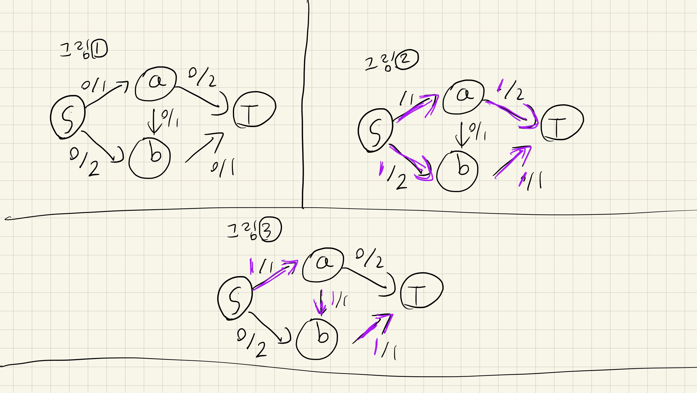
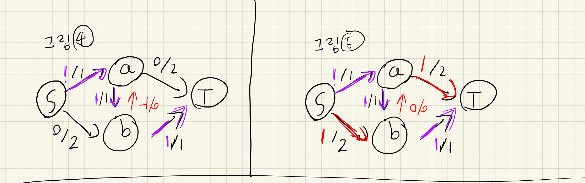
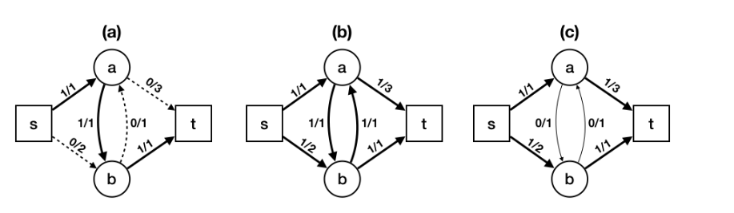
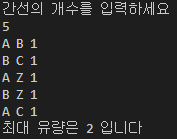
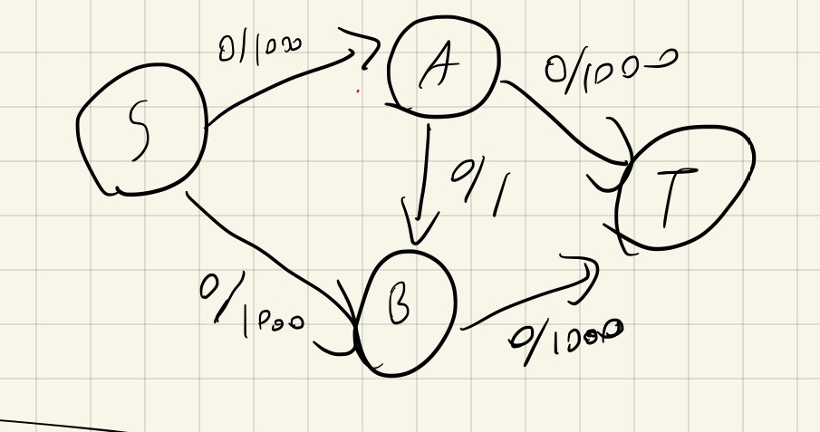

# Ford fulkerson algorithm

---
## 최대 유량 문제(Maximum Flow Problem)
- 포드 풀커슨 알고리즘을 알아보기 전에 **최대유량 문제**에 대해 알아야한다.
- **최대 유량 문제**는 
  - 그래프에서 두 정점 사이에 얼마나 많은 유량(flow)를 보낼 수 있는지  계산하는 알고리즘이다.
  - 네트워크 플로우(network flow) 라고도 한다.
  
### 기본 용어 설명 
- **용량(capacity)**
  - 간선의 최대 유량 
- **유량(flow)**
  - 간선에서 실제 흐르고 있는 유량
- **잔여용량(Residual Capacity)**
  - 용량과 유량의 차이
- **소스(source)**
  - 유량을 시작하는 정점
- **싱크(sink)**
  - 유량이 도착하는 정점
- **증가 경로**
  - 소스에서 싱크로 유량을 보낼 수 있는 경로
### 기본 속성
- **용량 제한 속성**
  - 유량은 용량보다 작거나 같다.
- **유량의 대칭성**
  - 정점 a에서 b 로 유량을 보내는 것은 b에서 a로 음수의 유량을 보내는 것과 동일하다.
- **유량의 보존성**
  - 각 정점을 기준으로 들어오는 유량과 나가는 유량은 같다. 

## 기존 최대 유량 문제의 문제점

- 그림 1과 같은 네트워크가 있다고 가정하자.
- 그림 2 처럼 s->a->t 와 s->b->t를 탐색하면 최대유량은 2가 되어 정답이 된다.
- 하지만 그림 3 처럼 s->a->b->t를 먼저 탐색하게 되면 최대 유량이 1이 되어버린다.
- 이를 해결하기 위해 **유량상쇄를 사용하는 포드-풀커슨 알고리즘과 에드몬드-카프 알고리즘**을  사용하게 된다.

## 유량 상쇄
- 포드 풀커슨 알고리즘을 설명하기 전에 유량 상쇄에 대해 설명해보자.
- **유량 상쇄**란 유량의 대칭성을 이용하여 기존에 존재하는 간선과 반대되는 방향의 간선을 추가한 뒤,
- 반대방향의 간선으로도 같이 유량을 흘려보내서 유량을 상쇄시키는 것이다.  

- 그림을 보며 예를 들어보자. 유량과 용량이 1인 a->b의 간선이 존재한다.
- 그림4 와 같이 역간선인 b->a의 유량은 기존의 간선과 반대이므로 -1이 되며
- 용량은 실제로 존재하는 간선이 아니므로 0이 된다.
- 따라서 해당 간선에 흐를 수 있는 유량의 양인 잔여 유량r(b,a)는 용량-유량=1이 된다.
- 즉, 간선이 없는 역방향으로도 1만큼의 유량을 흘려 보낼 수 있게 되는것이다.
- **Q.** 어떻게 실제로 존재하지도 않는 간선으로 유량을 보낼 수 있는것일까?
- **A.** 흘러오는 유량을 줄이는 것은 상대에게 유량을 보내주는 것과 같은 효과이기 때문이다.

- **그림 (a)** 를 보았을 때, 점선으로 표시된 간선을 통해 유량을 t로 보내면 **그림(b)** 가 된다.
- 그렇다면 간선a와 b 사이에선 1을 주고 1을 받는것이니. 서로 상쇄하여 없애면
- **그림 (c)** 같이 **유량의 속성들을 성립**하는 네트워크가 그려진다.
- 따라서 **새 유량을 보내는 것과 기존 유량을 상쇄하는 것은 사실상 같은 연산**이라 할 수 있다.

## 포드 풀커슨 알고리즘
1. 각 간선의 용량을 입력받는다.
2. 소스에서 싱크로 갈 수 있는 잔여 용량이 남은 경로를 DFS로 탐색한다.
- **DFS란? 깊이 우선 탐색이라고 하며, 루트노드에서 시작하여 다음 분기로 넘어가기 전에 해당 분기를 완벽하게 탐색하는 방법이다.**
3. 경로 상의 간선 중 잔여 용량이 가장 낮은 것을 유량으로 흘려보낸다.
4. 해당 유량에 음수값을 취해,역방향 간선에도 흘려보낸다.
5. 잔여 용량이 남은 경로가 존재하지 않을때까지 반복한다.

# 포드 풀커슨 코드 실행 
- 코드는 깃허브의 ford-fulkerson.py에 있다.

- A에서 Z로 가는 최대 유량을 계산하는 프로그램을 작성하였다.
- 결과값은 그림(1)의 그래프를 구현해보았다. 결과값이 제대로 나오는 것을 확인 할 수 있었다.
- 보고서가 길어지므로 첨부하지는 않았지만 여러 그래프들이 제대로 결과값이 나왔다.

## 포드 풀커슨의 단점
- 그림으로 예를 들어보자.

- 이렇게 용량이 1000이 되어버리면, DFS방식으로는 2000번의 탐색으로 최대 유량을 찾아내게 된다.
- ex) S->A->B->T를 통하여 1을 보내고, S->B->A->T를 통하여 1을 보내고...를 반복
- 이렇게 일반적으로 오래 걸리는 일을 방지하기 위하여, **BFS를 이용한 에드몬드 카프 알고리즘**을 사용한다.

## 에드몬드 카프 알고리즘 코드 실행
- 코드는 깃허브의 edmonds-karp.py에 있다.

- 다른 예시들로 충분한 검증을 거친 코드이다.
- 방식은 포드 풀커슨과 같아서 값들도 똑같이 나온다.
- 하지만 포드 풀커슨과 달리 BFS 방식을 사용하였다.
- **BFS 를 사용하여 위의 그림을 해결하면, A->B->D로 1000의 유량을 보내고 A->C->D로 1000의 유량을 보내서 2번의 탐색만으로 최대 유량을 찾아낸다.**
- --
## 두 알고리즘의 성능 분석
## 시간복잡도
- 포드 풀커슨 알고리즘의 시간복잡도는 **O((V+E)F)** 지만 일반적으로 간선의 개수가 많으므로 일반적으로 **O(EF)** 이다.
- **E**는 간선의 갯수,**V**는 정점의 갯수, **F**는 증가경로의 최대 유량이다.
- 에드몬드 카프 알고리즘의 시간복잡도는 일반적으로 **O(VE^2)** 라고 한다.
- 많은 경우에서 에드몬드 카프 알고리즘이 포드 풀커슨 알고리즘보다 복잡도가 낮겠지만.
- 간선이 유량에 비해 상당히 많은 경우에는 포드 풀커슨 알고리즘이 효율적인 경우도 있을 수 있다.
- 